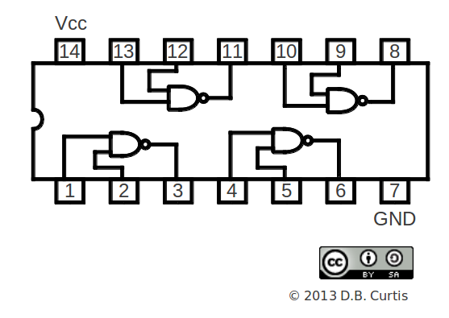
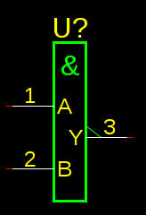

Ansisym User's Guide
--------------------

ansisym is a command line tool for generating symbols for gschem, the
gEDA system schematic editor.

Author:  David B. Curtis
Date: 

# Why ansisym?

Because schematics should be readable, clear, and beautiful.

Many schematics that I see today are nothing but a jumble of ad-hoc boxes.
The ones that are just symbol splats and airlines can bring me to fits of cursing.

Blame history.

Long ago, during my formative years as an engineer,
I worked at a succession of employers where I became thoroughly pickled in ANSI symbology.
The grey-beards across the table during design reviews expected a high level of readability
in schematics.
(Note: It is Not Good to bring grey-beards on the other
side of the design review table to fits of cursing.)
ansisym is a tool to help me create a library of schematic symbols that don't make my eyes bleed, 
and that those old grey-beards from my past would find acceptable.
This means ANSI symbols, although I admit that ansisym isn't perfect at generating fully-correct
ANSI symbols.
At least my eyes don't bleed.
Hopefully, you will find the symbols readable and pleasing as well.

Beyond that, ansisym simplifies creating multiple views
of a part that allow functionality
to be split to different pages.
For example, the power supply pins for a part can easily be specified as a separate block, so that all 
power supply infrastructure can go on sheets separate from the logic, thus avoiding cluttering
the signal flow on logic sheets.
Grey-beards hate clutter.
The symbols produced by ansisym enable the creation of readable, even beautiful, 
schematics that are quick and easy to navigate and a pleasure to use. (Some assembly required.)

(Aside: I gather that what I think of as ANSI symbols are now properly called IEC/IEEE symbols. Oh well.)

# ansisym Tutorial

## The ansisym Work Flow

In old-fashioned terms,
ansisym is a simple text-to-text one-shot program.
The input source text is simple and terse, but quick and easy
to generate from a datasheet.
The output is one or more .sym files for gschem.  
Each .sym file is a view of a part of or all of the component.

The workflow is:

- Read the datasheet, decide what you want the symbol(s) to be.
- Translate data from the datasheet into a .symt file that
  describes the desired blocks.
- Invoke ansisym.
- Validate the resulting symbols.
- Squirrel away the .sym file(s) in your symbol library.

Not too surprising. Time for an example.

## Example #1: 74X00

In which some basic symbols are created.

The "Quad 2-input NAND gate" '00 part is well known to everyone, and illustrates many key
features of ansisym.
First, recall the I/O for the generic '00:

For this part we want three symbols:

- A 2-input, 1-output NAND block with positive-logic I/O.
- A 2-input, 1-output NOR block with negative-logic I/O.
- A 1-input, 1 output block for power supply infrastructure connections.

The next step is creation of the input .symt file.
A comment at the top of the file is always well taken.
Comments are lines starting with '#'.

    # Generic '00 Quad 2-input NAND

Next, we know that all gschem symbols need `device` ,`refdes`,
and description attributes. 
(If you did not know that, take a look at _.)
In ansisym, attribute lines start with a 'A'.

    # Generic '00 Quad 2-input NAND
    A device 74X00
    A description "TTL 2-input NAND"
    A refdes U?

The attributes become part of every symbol generated by the
.symt file, you only need to specify them once.
There are also numerous "boilerplate" attributes that should be
included, such as copyright, author, license, and so forth.
You can specify your own bolerplate attributes file and pull it
in with 'AB'.
(The contents of the boilerplate file are detailed in _.)

    # Generic '00 Quad 2-input NAND
    A device 74X00
    A description "TTL 2-input NAND"
    A refdes U?
    AB

At this point we are ready to start specifying the blocks.
The 'BK' keyword starts a block line, and the paramter is
the name of the symbol, which also becomes the name of the resulting
.sym file.  Let's start with the positive-logic block.
Following gschem conventions, the symbol is named 74X00-1.
    # Generic '00 Quad 2-input NAND
    A device 74X00
    A description "TTL 2-input NAND"
    A refdes U?
    AB
    BK 74X00-1

And now, a time-out for a word about `bands`.
ANSI symbols can be considered as a stack of information
bands.
A band is a horizontal slice of the symbol, that may 
have an input (or bidirectional I/O) on the left, an output
(or bidirectional I/O) on the right, and some informative
glyphs or text in the middle.
ansisym specifices a block as a list of bands in
top-to-bottom order, one band per line.

Now back to the tutorial, where we specify the bands
that make up the NAND block.

At the top of an ANSI symbol is a glyph representing the
function.
The top of the symbol also serves as the positional anchor
in gschem for certain key attributes.
For these reasons, in ansisym a block must start with
a `top` band, which 
is a 'T' line in the source file.
A `top` band has no input and no output, simply a glyph
in the middle.
In ANSI symbols, the function glyph for an AND block is
'&'.  Since ansisym uses '&' as the escape to pull
non-ASCII glyphs into strings, it must itself be escaped. 
This 'T' line puts a single '&' at the top of the block:

    # Generic '00 Quad 2-input NAND
    A device 74X00
    A description "TTL 2-input NAND"
    A refdes U?
    AB
    BK 74X00-1
    T &&

The 'x00 contains four identical NAND gates. 
In gschem terminology, each is a `slot`. 
(If you are not familiar with the gschem 'slot' concept,
refer to _.)
We only need to define the block once, but we need to list 
the pin numbers for every slot.
The symbol will look nicely symmetrical if the first 
input is on one band, the output on a band below that,
and the second input on another band below the output
band. 
Here are the three IO bands that create that layout:

    # Generic '00 Quad 2-input NAND
    A device 74X00
    A description "TTL 2-input NAND"
    A refdes U?
    AB
    BK 74X00-1
    T &&
    IO A 1,4,9,12;;
    IO ;;~Y 3,6,8,11
    IO B 2,5,10,13;;

OK, that's terse, but not modem noise.
What does it mean?
An `IO` band is split into three tiles, left, middle and right, 
which are the three tiles in a ANSI symbol band.
The ';' separates the tiles.
The first `IO` line specifies:

- The input pin name is "A".
- The pin numbers for the 4 slots are 1, 4, 9, and 12.
- There is no glyph in the middle of the band.
- There is no output from the band.

That is simple enough.
The third band has the identical format with different data.
You can probably guess what is specified by the second `IO` band:

- There is no input pin.
- There is no glyph in the middle of the band.
- The outout pin has an 'inversion' flag, specified by '~'.
- The output pin name is 'Y'.
- The pin numbers for the four slots are 3,6,8, and 11.

That's it! 
The block has been completely specified in four bands.
The result looks like this:

Hmmm... that looks a little skinny.  Maybe you like skinny
symbols and it doesn't bother you.  If it *does* bother you,
keep reading, some options to adjust the width are discussed
a little further on.

It is important that slot pin numbers be consistent. 
The pin number lists *must* be the same length for all pins
in a block.  
The order of the pin numbers in the pin list is the
order the pins are assigned to slots.

The symbol for the 'negative-logic' version of the '00 
gate is specified as another block.
It needs to have a different symbol name and file name.
The convention of using the '-n1' suffix for negative
logic symbols is convenient.
Here is the .symt file with the negative-logic symbol
added:

    # Generic '00 Quad 2-input NAND
    A device 74X00
    A description "TTL 2-input NAND"
    A refdes U?
    AB
    BK 74X00-1
    T &&
    IO A 1,4,9,12;;
    IO ;;~Y 3,6,8,11
    IO B 2,5,10,13;;
    BK 74X00-n1
    T &ge&1
    IO ~A 1,4,9,12;;
    IO ;;Y 3,6,8,11
    IO ~B 2,5,10,13;;

The ANSI glyph for an 'OR' gate is '&ge;1', which means
"one or more inputs true."
In ansisym, the escape code '&ge&' yields the &ge; glyph.
Inversion flags have been added to the inputs, and removed
from the output, otherwise, the symbol is the same as
the positive-logic version.
Praise be to DeMorgan.

One thing remains, and that is to add the power supply
infrastructure block.
The naming convention for power blocks is the '-p1' suffix.
The power block has only a single IO band.
Here is the completed file:

    # Generic '00 Quad 2-input NAND
    A device 74X00
    A description "TTL 2-input NAND"
    A refdes U?
    AB
    # Positive logic symbol
    BK 74X00-1
    T &&
    IO A 1,4,9,12;;
    IO ;;~Y 3,6,8,11
    IO B 2,5,10,13;;
    # Negative logic symbol
    BK 74X00-n1
    T &ge&1
    IO ~A 1,4,9,12;;
    IO ;;Y 3,6,8,11
    IO ~B 2,5,10,13;;
    # Power supply symbol
    BK 74X00-p1
    T 74X00
    IO Vcc 14;;GND 7

Note that all of the symbols inherit the same global attributes,
and that slot attributes are automatically computed.
By default, invoking ansisym on this input file generates
all three .sym files.

What about that width issue?
You can specify directives to ansisym at any time before
the first attribute spec.
Directive lines start with '%', and consist of a keyword
and an optional value.

Two layout directives are 'minwidth' and 'samewidth'.  Minwidth
allows you to specify
a minimum width that applies to all blocks in the file.
Samewidth sets the width of all blocks to be the minimum 
width that accomodates the widest symbol.
Adding:

    %minwidth 600

To the top of the file produces symbols with a little more 
presense.

Here is an example schematic using these symbols:

- Add picture here of mux.

(-p1, -c1, -n1)

## Example #2 - Necks, Clocks, anonymous pins, and Tri-state outputs.

In which control blocks and some special pin types are demonstrated.

## Example #3 - A Microcontroller

In which a complicated part with multiple package footprints is demonstrated.

Note: Shadow pins and slotting can not be used together in the
same symbol block.  

## Example #4 - Unused Pins

In which unused pins are demonstrated.

## Example #5 - Spacers

In which jiggery-pokery enabling deviant symbols is demonstrated.

# ansisym Reference

## Invoking ansisym

## Ansisym File Structure

- Directives, if present, must be the first non-comment lines.
- Attributes must appear after Directives and before Blocks.
- Blocks must start with a Top band, and consiste of a sequence of bands.
- Comments can appear anywhere

Overall Structure:

    Optional Directives: (Lines starting with '%'.)
    Attributes: Required. (Lines staring with 'A' or 'AB'.)
    Block ('BK')
      Top Band ('T')
      Other Bands...
    Block...
      

## Ansisym Lexical Conventions

### Comments

### Keywords

### Strings

#### Escape sequence glyphs

Ampersands start and terminate a special glyph escape.
``&&`` is the escape to insert a single ampersand.
Others are ``&name&``.

#### Attribute references

The at-sign starts and terminates an attribute reference.
The value of the attribute will be made visible at the
text layout location.  
Layout computations are done using the value of the 
attribute at symbol generation time, so be sure to 
allow room for the user to change the value if that
is expected.

### Numbers

### Pin flags

## Ansisym Keywords

### A keyword: Attribute 

Attribute lines have two string fields, an attribute name and an attribute value.

    A <attr name> <attr value>

### AB keyword:  Attribute Boilerplate

The 'AB' keyword pulls in the attribute boilerplate file, see _.

### BK keyword:  Block

### IO keyword:  Input/Output

### T keyword:  Top

### U keyword:  Unused pins

Lists intentionally unused pin numbers, suppressing the "missing pin" error.
All pin numbers from 1 to the maximum pin number encoutered are expected
to be used.
The test is computed per package.

### % keyword:  Directives

### ] keyword:  Neck band

Creates a neck band, with optional center text.

### | keyword:  Center tile only band

The '|' band is a vertical spacer.  
Optionally center text, one or more glyphs, a combination of text and glyphs,
or a rectangular space reservation may be specified.

    |
    | "A Note"
    | [200]
    | &amp&

### |^ keyword:  Center tile with arbitrary up-kerning.

The same as '|', but the center tile is up-kerned by an arbitrary amount.

    |^ 75 "Foo Note"

Note that the layout engine does not take up-kerning into account when
computing space reservations, so up-kerned graphics and text run the risk
of colliding with the contents of the band(s) above.:

### - keyword:  Separator band, zero height

Causes a horizontal line to be drawn across the symbol between the surrounding bands.

### -- keyword:  Separator band, one grid height

Creates a band with height of one grid unit.
A horizontal line is drawn across the symbol in the middle of the band.

### # keyword:  Comment

A comment line may appear anywhere and is ignored.

## Spacer Syntax

The layout engine can be forced to reserve space by specifying a
reserved rectangle.
A spacer is allowed anywere a center-text string is allowed.
Square brackets ('[', ']') denote reserved space.
A single number specifies a width reservation with zero height, which
therefore has no impact on vertical spacing.
A reserved rectangle is specified as a width and a height, and will 
force the band to be at least tall enough to accomodate that height.
Note that the layout engine rounds all band width and heigth 
computations up to the nearest grid distance.

    | [ 300 ] 
    IO A 1;[400,400];~Y 2

## Pin Flags

### ^ pin flag: clock

Input pin is drawn with the "edge sensitive" indication.

### ~ pin flag: inversion

Pin is drawn with an inversion flag.

### % pin flag: bi-directional

Pin is drawn with bi-directional arrows.

### /pas pin flag

### /tie pin flag

Tie this input to the above pin, graphically.  
It is the same physical pin, but has a 2nd logical input to the ANSI symbol.

### /br pin flag

Indicate that this pin is bridged internally to the above pin.
(By drawing a small "staple" inside the symbol.  User still needs to
connect this pins externally. No, it is not ANSI.)

## Boilerplate Attributes

Described here...

# Reference Material

## gEDA Rules and Conventions

### Required Attributes

Strictly speaking, gEDA has no required attributes beyond

As a practical matter, some are important enough that
for they might as well be considered required.

- Required attributes
- Strongly recommended attributes
- Power supply names
- Symbol naming conventions

## ANSI Symbol Conventions

*To be written.*

## A Word About Symbol Style

At some point, decisions about how to design symbols
becomes a matter of taste.
Here are some guidelines that I find useful.

- Split power infrastructure to a separate block.
  Power supply pins need to be shown somewhere. Implicit
  power connections are confusing to the reader and
  become too clever by half when a board has split power
  planes or ground planes, split power supplies, etc.
  By putting power onto a stand-alone block, all power
  blocks can be moved to infrastructure pages so the
  power distribution view of the design can be easily
  seen and does not clutter the logic flow. 

- The area above the neck is the ANSI-standard place
  for control signals. Use it.

- Oscilator infrastructure can go on a block by itself
  as well.  Some microcrontroller parts now, though, 
  allow a oscilator pins to be used as GPIO when running
  on an internal oscilator, in which case it makes more
  sense to leave them on the main block.
  
- Make every connection explicit, so that all connections show up on schematic. 
  This means no hidden power supply pins.
  This means when two pins are tied internally to the chip, bring out both pins and
  require the user to connect to both so that the netlist is generated correctly.
  gschem has no mechanism to rule check this. 

